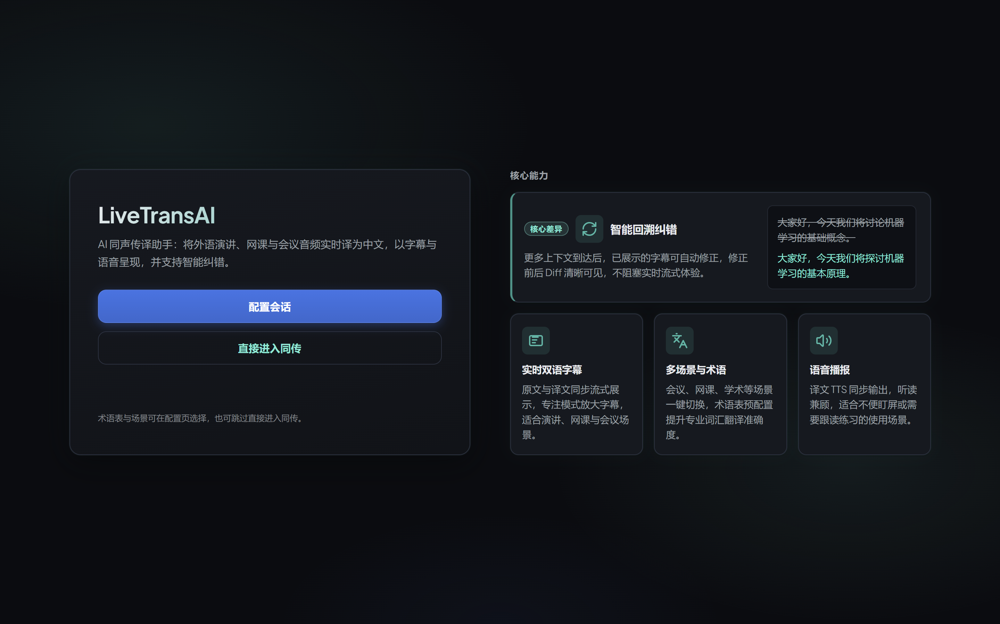
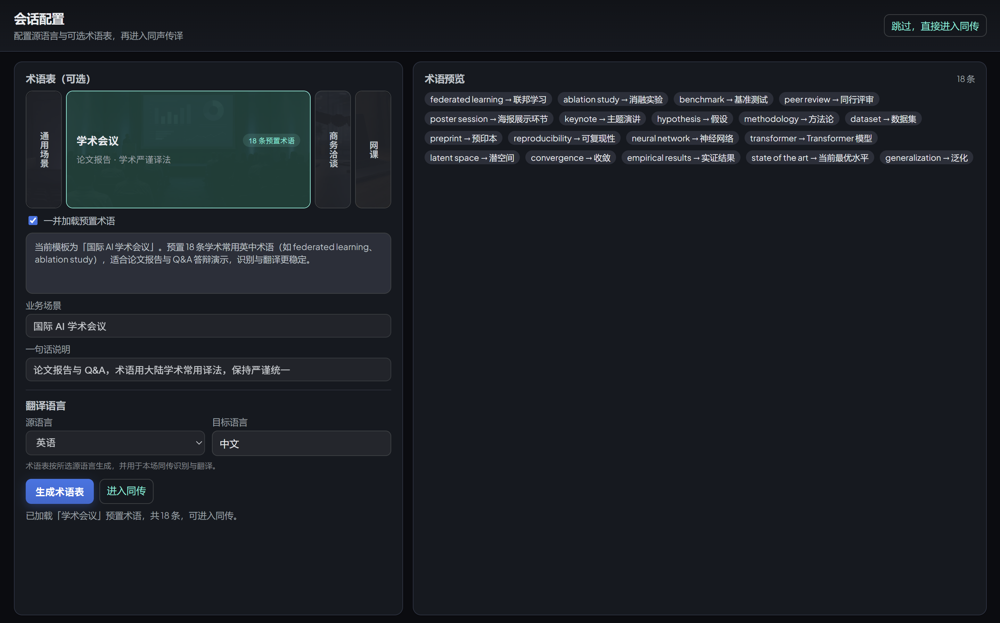
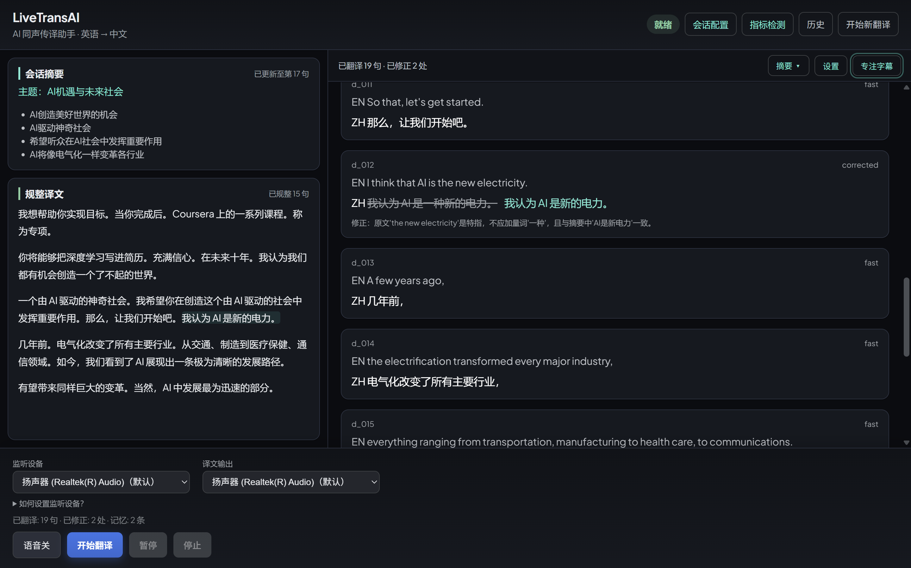
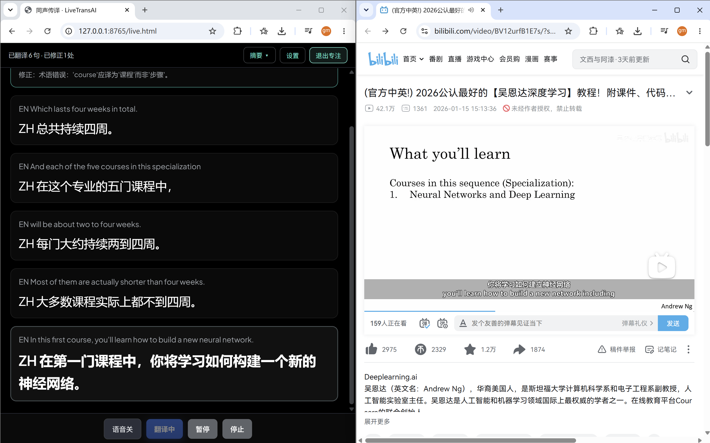
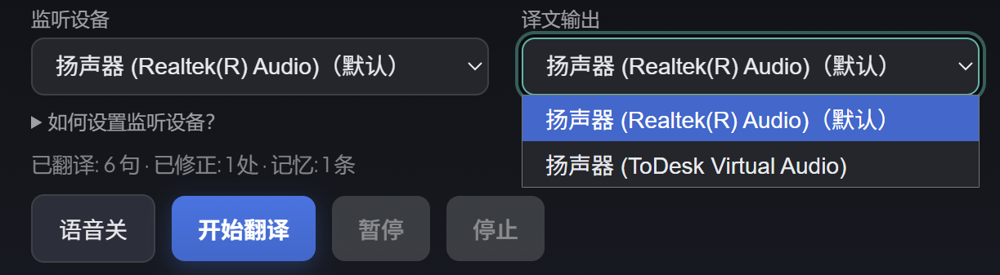
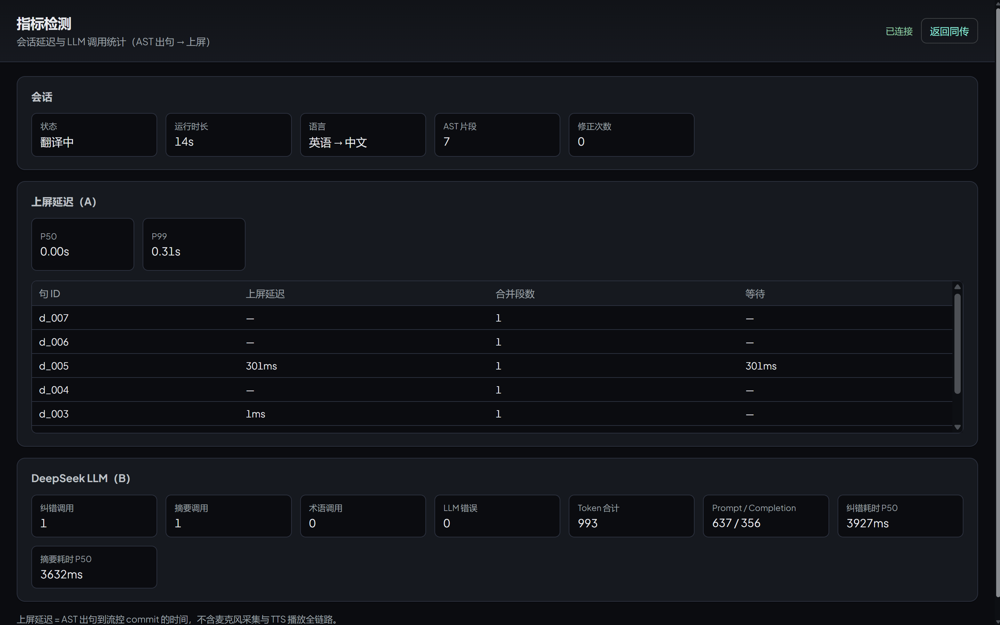
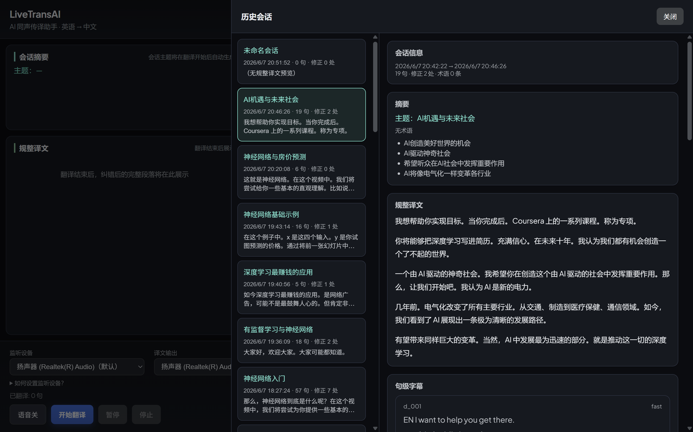
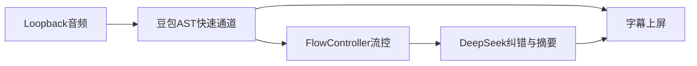

# LiveTransAI

> **Demo 演示视频**：[待上传 — 点击替换为 B 站/网盘链接](https://example.com)

AI 同声传译助手：将外语音频实时译为中文，以字幕与语音呈现，并在不阻塞实时性的前提下支持回溯纠错。

<p align="center">
  
</p>

---

## 项目简介

LiveTransAI 面向**网课、演讲、技术分享、国际会议**等场景：用户播放电脑上的外语音频，系统通过 Windows 声卡回采（WASAPI loopback）捕获音频，经豆包同声传译（AST）实时输出中英字幕；后台 DeepSeek 结合会话摘要与术语表，对已有译文做异步校对并在 UI 上展示修正。

**核心差异化**：不重复造底层同传模型，而是在应用层编排「快速通道 + 后台纠错」，让用户既能跟上节奏，又能看到可感知、可追踪的译文修正。

**运行环境**：Python 3.10+、Windows、Chrome / Edge。

---

## 核心功能

| 模块 | 说明 |
|------|------|
| 实时同传 | 豆包 AST 快速通道，原文/译文流式上屏 |
| 多源语言 | 英语、日语、葡萄牙语、西班牙语、印尼语、德语、法语 → 中文 |
| 智能纠错 | DeepSeek 异步校对；旧译删除线 + 新译高亮 + 修正原因 |
| 会话摘要 | 增量更新主题、术语表、要点列表 |
| 规整译文 | 纠错批次完成后合并为可读段落 |
| 术语表 | 内置场景（网课 / 学术会议 / 商务洽谈等）+ LLM 生成；注入 AST 识别与纠错提示 |
| TTS 语音 | 中文语音播报；支持后端独立扬声器或浏览器播放 |
| 暂停 / 恢复 | 应用层静音保活 AST 会话，恢复后继续同一会话 |
| 历史会话 | 停止后落盘，可回看句级记录（含纠错样式） |
| 指标检测 | 上屏延迟 P50/P99、DeepSeek 调用与 token 统计 |

---

## 界面预览

### 会话配置

选择源语言、内置演示场景与术语表，再进入同传。

<p align="center">
  
</p>

### 实时同传与智能纠错

快速通道字幕实时上屏；后台 DeepSeek 校对后，旧译删除线、新译高亮显示。

<p align="center">
  
</p>

### 专注字幕模式

隐藏侧栏，放大字幕，适合分屏看网课或演讲视频。

<p align="center">
  
</p>

### 译文语音

支持开启中文 TTS，后端独立扬声器或浏览器播放。

<p align="center">
  
</p>

### 指标检测

独立页面展示上屏延迟与 DeepSeek 调用统计。

<p align="center">
  
</p>

### 历史会话

停止翻译后会话落盘，可回看摘要、规整译文与句级记录（含纠错样式）。

<p align="center">
  
</p>

---

## 快速开始

### 1. 安装依赖

```bash
python -m venv .venv
.venv\Scripts\activate
pip install -r backend\requirements.txt
```

### 2. 配置 API Key

```bash
copy .env.example .env
```

编辑 `.env`，至少填写：

- `DOUBAO_API_KEY` — 豆包 AST（必填）
- `DEEPSEEK_API_KEY` — 纠错与摘要（可选；未配置时仅快速通道可用）

### 3. 启动服务

```bash
python -m backend.main
```

浏览器打开：**http://127.0.0.1:8765/**

### 4. 使用方法

推荐从 **网课** 场景进入（预置术语，无需现场调 LLM）：

1. 首页 → **配置会话** → 在 `/setup.html` 点 **网课** 场景（可勾选「一并加载预置术语」）
2. **进入同传** → `/live.html` → 选择 **监听设备** → **开始翻译**
3. 播放英文音频，观察右侧字幕、左侧摘要，以及纠错后的删除线/高亮

**快速路径**：首页 **直接进入同传**（无需术语表）。

**音频提示**：播放器（浏览器 / 视频软件）的输出设备需与同传页「监听设备」对应；可在 Windows **设置 → 系统 → 声音 → 应用音量和设备偏好设置** 中指定。

---

## 页面导航

| 路径 | 说明 |
|------|------|
| `/` | 落地页（配置会话 / 直接进入同传） |
| `/setup.html` | 会话配置：源语言、场景卡片、术语表生成 |
| `/setup-view.html` | 翻译进行中的只读配置快照 |
| `/live.html` | 同声传译主界面（字幕、摘要、规整译文、控制栏） |
| `/metrics.html` | 指标检测（延迟与 LLM 统计，需先开始翻译） |

同传页还支持：**专注字幕**、**历史会话**、**暂停 / 恢复 / 停止**、**语音开关**。

---

## 架构概览



- **快速通道**：AST 出句 → 流控合并/上屏 → WebSocket 推送前端
- **慢通道**：摘要每 5 句增量更新；纠错在积累足够上下文后异步运行，不阻塞实时字幕
- **术语表**：会话开始时注入 AST corpus，并参与 DeepSeek 纠错提示词

详细设计见 [技术方案.md](技术方案.md)。

---

## 环境变量

| 变量 | 说明 |
|------|------|
| `DOUBAO_API_KEY` | 豆包 AST API Key（必填） |
| `DOUBAO_AST_WS_URL` | AST WebSocket 地址（默认官方 v4） |
| `AST_MODE` | `s2s` 同声传译（含 TTS） |
| `SOURCE_LANGUAGE` | 默认源语言（会话配置页可覆盖） |
| `TARGET_LANGUAGE` | 目标语言，固定为 `zh` |
| `AST_TARGET_AUDIO_FORMAT` | TTS 格式，推荐 `pcm` |
| `TTS_PLAYBACK` | `backend` 后端扬声器 / `browser` 浏览器播放 |
| `DEEPSEEK_API_KEY` | DeepSeek API Key（纠错/摘要/术语生成） |
| `DEEPSEEK_MODEL` | 默认 `deepseek-chat` |

完整示例见 [.env.example](.env.example)。

---

## 开发与测试

- 环境搭建、Smoke Test、暂停恢复说明 → [docs/development.md](docs/development.md)
- AST 协议与 Event 速查 → [docs/ast-api-cheatsheet.md](docs/ast-api-cheatsheet.md)

常用命令：

```bash
# AST 离线音频测试
python -m backend.smoke_ast --audio ast_python\test_audio.wav

# 列出回采设备
python -m backend.smoke_audio --list

# 单元测试
python -m unittest discover -s backend\tests -v
```

---

## 目录结构（简要）

```
LiveTransAI/
├── backend/          # FastAPI、AST 客户端、流控、纠错、持久化
├── frontend/         # Web UI（落地页、同传、配置、指标）
├── docs/             # 开发与 API 文档
│   └── images/       # README 截图
├── data/sessions/    # 历史会话落盘（运行时生成）
└── .env.example      # 环境变量模板
```

---

## 题目对应

本项目对应实训题目 **「AI 同声传译助手」**：

- 将单向音频流实时、流畅地翻译为中文，以**字幕或语音**呈现
- 具备**修正能力**，自动纠正之前识别或翻译的错误

详见 [题目.md](题目.md)。
